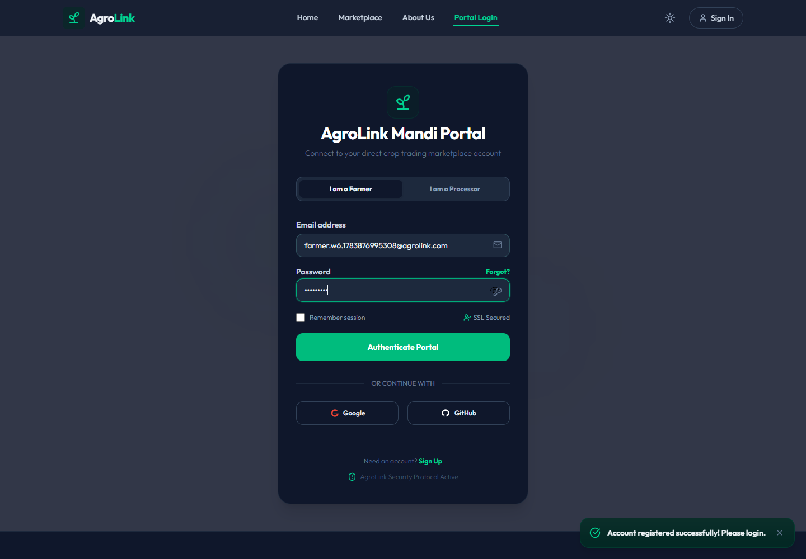
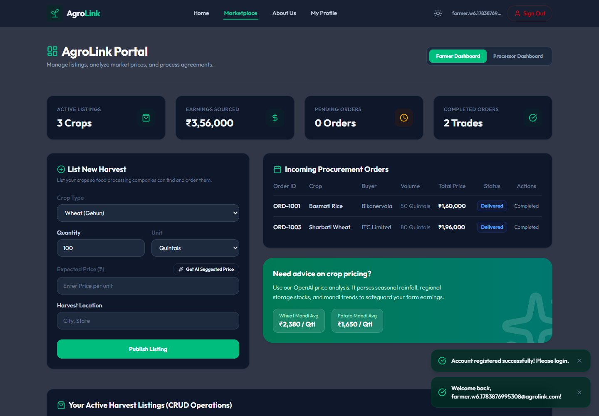
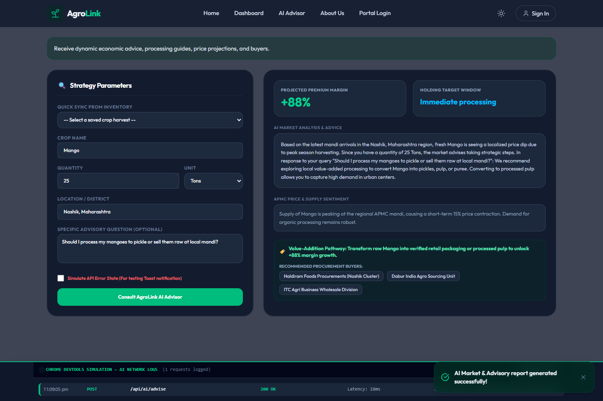

# AgroLink 🌾

> A secure, direct-to-factory agricultural marketplace connecting farmers to food processing units, powered by Google Gemini AI-driven market pricing and value-addition advisories.

## Live Demo
Experience the live application deployed on production environments:
- **Live Frontend**: [https://agro-link-rouge.vercel.app](https://agro-link-rouge.vercel.app)
- **Live API Backend**: [https://agrolink-62eo.onrender.com](https://agrolink-62eo.onrender.com)

---

## Screenshots
Below are key screens demonstrating the user interface and functionality of AgroLink:

### 1. Mandi Authentication Portal (OAuth & JWT)
A secure login experience whitelisting roles and featuring simulated Google and GitHub single sign-on.


### 2. Farmer Dashboard (Active Harvest Listings)
Enables farmers to list, edit, and delete crop listings, view incoming procurement offers, and utilize AI pricing.


### 3. AI Market Strategy & Advisory Advisor
Consults Google Gemini models dynamically to get projected premium margins, holding windows, and value-addition advice.


### 4. Relational Database Schema (Prisma ORM Design)
Type-safe relational database tables (User, Listing, Order) mapping farm products to factory buyers.


---

## Features
- **Direct Sourcing Marketplace**: Eliminates middleman commission agents by matching farmers directly to food processing units.
- **Dynamic Farmer CRUD Operations**: Complete create, read, update, and delete flows for harvest postings (crop type, quantity, pricing, and location).
- **Instant Procurement Agreements**: Processing companies place direct offers on active harvests, tracking the full contract lifecycle (Pending, Accepted, Delivered).
- **Simulated OAuth Identity**: Complete mock Google and GitHub OAuth flow with simulated consent pages mapping user accounts to AgroLink roles.
- **AI Price Recommendation Modal**: Fetches regional mandi benchmark pricing, seasonal rainfall statistics, and factory demand levels to output suggested price ranges.
- **AI Value-Addition Strategy**: Advises farmers on processing raw crops (e.g. wheat to flour, mango to pulp/pickle) to maximize profit margins.
- **Chrome DevTools Network Console**: Real-time simulated HTTP POST logger allowing users to monitor API latency, status codes, and payloads directly in the browser.
- **Dual-Theme Design System**: Fully responsive mobile and desktop styling supporting fluid light and dark modes.

---

## Tech Stack
- **Frontend**: React.js (Vite) + Lucide Icons
- **Styling**: Vanilla CSS + Tailwind CSS v4 design system
- **Backend**: Node.js + Express.js API Server
- **Database**: SQLite (Development) + PostgreSQL (Production ready) connected via Prisma ORM
- **Authentication**: JSON Web Tokens (JWT) + Passport.js (Google/GitHub Strategies)
- **AI Integration**: Google Gemini 1.5 Flash (Live API with domain fallback)
- **Deployment**: Vercel (Frontend) + Render (Backend)

---

## Setup Instructions

### Prerequisites
- Node.js (v18.x or later)
- npm (v9.x or later)

### Step-by-Step Installation

1. **Clone the repository**:
   ```bash
   git clone https://github.com/adityax7078/AgroLink.git
   cd AgroLink
   ```

2. **Backend Setup**:
   Navigate to the `backend` folder, install dependencies, and setup the local database:
   ```bash
   cd backend
   npm install
   ```
   Create a `.env` file in the `backend` directory:
   ```env
   PORT=5000
   DATABASE_URL="file:./prisma/dev.db"
   JWT_SECRET="agrolink_jwt_secret_26101094"
   FRONTEND_URL="http://localhost:5173"
   BACKEND_URL="http://localhost:5000"
   GEMINI_API_KEY="your_actual_gemini_api_key_here"
   GOOGLE_CLIENT_ID="mock"
   GOOGLE_CLIENT_SECRET="mock"
   GITHUB_CLIENT_ID="mock"
   GITHUB_CLIENT_SECRET="mock"
   ```
   Push the schema to generate the local SQLite database and seed initial listings:
   ```bash
   npx prisma db push
   ```

3. **Frontend Setup**:
   Navigate to the `frontend` folder and install client dependencies:
   ```bash
   cd ../frontend
   npm install
   ```
   Verify that `.env` in the `frontend` directory points to the local backend port:
   ```env
   VITE_API_URL=http://localhost:5000
   ```

### Running Locally

1. **Start Backend Server**:
   ```bash
   cd backend
   npm run dev
   ```
   *The backend will boot up on `http://localhost:5000` and seed default users, listings, and orders.*

2. **Start Frontend Server**:
   ```bash
   cd frontend
   npm run dev
   ```
   *Open your browser to the URL output by Vite (typically `http://localhost:5173`).*

---

## API Documentation

All routes expect headers containing `Content-Type: application/json`. Protected endpoints require an `Authorization: Bearer <token>` header.

### 1. Authentication
* **POST `/api/auth/register`**: Registers a new user.
  * *Request*: `{"email": "user@test.com", "password": "password123", "role": "farmer"}`
  * *Response*: `{"id": 3, "email": "user@test.com", "role": "farmer"}`
* **POST `/api/auth/login`**: Authenticates credentials.
  * *Request*: `{"email": "farmer@agrolink.com", "password": "farmer123", "role": "farmer"}`
  * *Response*: `{"id": 1, "email": "farmer@agrolink.com", "role": "farmer", "token": "JWT_TOKEN"}`

### 2. Listings (Marketplace)
* **GET `/api/listings`**: Fetch crop listings. Supports query filters `?q=`, `?cropType=`, `?location=`.
  * *Response*: `[{"id": 1, "title": "Premium Sharbati Wheat", "price": 2450, "quantity": 120, "location": "Sehore, MP", ...}]`
* **POST `/api/listings`** *(Protected)*: Publish a harvest.
  * *Request*: `{"title": "Organic Basmati", "price": 3100, "quantity": 50, "location": "Karnal", "cropType": "Rice"}`
* **PUT `/api/listings/:id`** *(Protected)*: Update a listing.
* **DELETE `/api/listings/:id`** *(Protected)*: Destructive listing deletion.

### 3. Orders (Procurement Contracts)
* **POST `/api/orders`** *(Protected)*: Propose contract.
  * *Request*: `{"crop": "Premium Wheat", "processor": "buyer@test.com", "seller": "farmer@test.com", "qty": "100 Qtl", "total": "₹2,45,000"}`
* **PUT `/api/orders/:id`** *(Protected)*: Update status.
  * *Request*: `{"status": "Accepted"}` *(Options: Pending, Accepted, Rejected, Delivered)*

### 4. AI Strategic Advisors
* **GET `/api/ai/pricing?cropType=Wheat&quantity=100`**: Get price valuation bounds.
  * *Response*: `{"crop": "Wheat", "min": 2200, "max": 2420, "marketTrend": "Bullish", "factors": "Rainfall indices..."}`
* **POST `/api/ai/advise`**: Consult market margins.
  * *Request*: `{"cropName": "Mango", "quantity": 25, "unit": "Tons", "location": "Nashik", "query": "..."}`
  * *Response*: `{"projectedMargin": "+88%", "holdingWindow": "Immediate processing", "marketAdvice": "..."}`

---

## Folder Structure

```text
AgroLink/
├── frontend/
│   ├── src/
│   │   ├── components/      # Global Layout (Navbar, Footer, ProtectedRoute, AIAdvisor)
│   │   │   └── ui/          # Generic visual elements (Button, Input, Modal, Toast)
│   │   ├── pages/           # View pages (Home, About, Dashboard, Login, Profile)
│   │   ├── context/         # React Context provider (ThemeContext for Dark/Light mode)
│   │   ├── utils/           # Helper API fetch utilities
│   │   └── App.jsx          # Frontend client route definitions
│   └── package.json
└── backend/
    ├── prisma/
    │   ├── schema.prisma    # Database definitions (SQLite layout)
    │   └── dev.db           # Local SQLite file
    ├── server.js            # Main Express app, CORS, Passport, and AI advising logic
    └── package.json
```

---

## Known Limitations
* **Gemini API Rate Limits**: Under the free tier, live API requests can occasionally trigger `429 Rate Limit Exceeded`. An intelligent, domain-trained agricultural rules fallback engine is built-in to return advice when the API is rate-limited or offline.
* **Mock OAuth Strategy**: When client IDs are set to `mock`, OAuth strategies render simulated login consent windows rather than querying live Google/GitHub servers to allow local testing.
* **Database Reset on Restart**: Nodemon is configured to seed the SQLite file on backend startup. Any new listings published during local dev will reset when the Node process restarts.

---

## Credits & Acknowledgements
- **Development Tools**: Google Gemini (capstone coding pair-programming), Cursor/VS Code.
- **Tutorials & Docs**: Prisma ORM Client Docs, React Router v7 transition guides, Tailwind CSS v4 documentation.
- **Program Host**: TBI-GEU (Technology Business Incubator - Graphic Era University) Internship Capstone Program.
